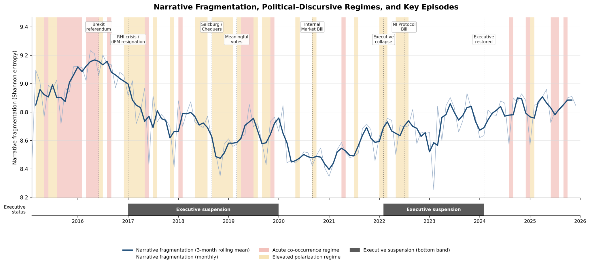

<div align="center">

# Narrative Fragmentation & Political Instability
### An AI-enabled analysis of Northern Ireland

**News discourse · Political dynamics · GDELT · 2015–2025**

[Getting started](#getting-started) · [Data](data/README.md) · [Reproducibility](docs/REPRODUCIBILITY.md) · [Citation](#citation)

</div>



*Author-supplied monitoring figure: monthly theme entropy and a three-month rolling mean, with regime shading and Executive-suspension periods. This image has not been regenerated from the cleaned notebooks.*

## About the project

Research code accompanying **Political Instability and Narrative Fragmentation as a Coupled System: An AI-Enabled Analysis of Northern Ireland**, by **Nuno Morgado, Amira Mouakher, and Zoltán Oszkár Szántó**.

The study examines how political instability and disagreement among geopolitical agents relate to fragmentation in news coverage of Northern Ireland over **February 2015–December 2025 (131 months)**. Narrative fragmentation is operationalized using Shannon entropy of monthly GDELT theme distributions.

> **Release status:** code, frozen CSV extracts and source PSNI workbook included. All three notebooks execute end to end from the bundled inputs and reproduce the manuscript's figures and statistics. See the [data inventory](data/README.md) and [methodological review notes](docs/REPRODUCIBILITY.md) and [validation report](docs/VALIDATION.md).

This is a research analysis, not a live monitoring service or a fact-checking classifier. Theme diversity does not identify false claims. Predictive associations do not establish causality. The manuscript reports that the association does not persist with media-independent instability measures.

## Analysis workflow

| Notebook | Purpose | Inputs |
| :--- | :--- | :--- |
| [01 · PSNI extraction](notebooks/01_psni_extraction.ipynb) | Extract monthly security indicators and check the annual shootings total | Official PSNI `.xls` workbook |
| [02 · Main analysis](notebooks/02_main_analysis.ipynb) | Indicators, dynamic regressions, directionality, temporal holdout, regimes, theme-embedding analysis and figures | Baseline Events and GKG CSVs |
| [03 · Robustness](notebooks/03_robustness_analyses.ipynb) | Geographic filtering, taxonomy composition, PSNI and Executive-suspension specifications | Baseline CSVs, strict GKG CSV and PSNI CSV |

## Getting started

Use Python 3.11 as a starting environment; the original execution environment was not supplied and dependencies are not a validated lockfile.

```bash
python -m venv .venv
# Linux / macOS
source .venv/bin/activate
# Windows PowerShell: .venv\Scripts\Activate.ps1
python -m pip install -r requirements.txt
python scripts/check_repository.py --require-data
jupyter lab
```

1. Check the bundled inputs in `data/` against `docs/data_manifest.json`.
2. Run notebook 01 if `psni_monthly.csv` needs to be generated.
3. Run notebook 02 from top to bottom, then notebook 03.
4. Review the generated figures and tables against the manuscript.

Notebooks resolve the repository root when opened from either the root or `notebooks/`. For another location, set `NARRATIVE_REPO_DIR` to the unpacked repository. In Colab, first make the entire repository and data available; Google Drive mounting is no longer automatic.

### Optional BigQuery extraction

Install `requirements-bigquery.txt`, configure Google Cloud credentials, and set `GCP_PROJECT_ID` and `RUN_BIGQUERY = True` in the relevant notebook. Local execution uses Google Application Default Credentials; Colab uses its authentication helper. Existing extracts are protected unless `OVERWRITE_EXISTING = True`.

Queries are provided as received and are not executed by default. Check their date coverage and estimated scan costs before submitting them. Fresh extracts can differ from the paper's frozen snapshot.

### Embedding model

Notebook 02 loads `all-MiniLM-L6-v2` through Sentence Transformers. The first run needs internet access to download the model, unless it is already cached. The supplied implementation embeds **GDELT theme labels**, not article bodies. See the reproducibility notes before describing this as independent news-content validation.

## Project files

| Path | Contents |
| :--- | :--- |
| `notebooks/` | Three notebooks with cleared outputs and portable paths |
| `data/README.md` | Required filenames, schemas and provenance checklist |
| `figures/` | Supplied monitoring figure; main notebook writes figures here |
| `results/reference/` | Author-supplied regression and sensitivity outputs |
| `docs/` | Reproducibility notes, coding decisions and publication guide |
| `scripts/check_repository.py` | Notebook structure, Python syntax and missing-input checks |
| `.github/workflows/validate.yml` | Static checks on pushes and pull requests |
| `CITATION.cff` | GitHub-readable citation metadata |

## Citation

Use the manuscript title and author list below. Publication details for this manuscript were not supplied; no journal acceptance, DOI or release identifier is asserted.

```bibtex
@unpublished{morgado_narrative_fragmentation,
  author = {Morgado, Nuno and Mouakher, Amira and Sz{\'a}nt{\'o}, Zolt{\'a}n Oszk{\'a}r},
  title = {Political Instability and Narrative Fragmentation as a Coupled System: An {AI}-Enabled Analysis of Northern Ireland},
journal ={Humanities and Social Sciences Communications},
  note = {Research manuscript; accompanying analysis code}
}
```

## Contributing and reporting issues

For a reproducibility issue, include the notebook and cell, traceback, Python/package versions and input provenance. Do not attach credentials. Discuss changes to indicator definitions or statistical specifications before merging them; they may change the paper's results.

## License and data rights

Code is distributed under the [MIT License](LICENSE), following the license choice in the supplied README. Third-party datasets retain their own terms; this code license does not relicense GDELT or PSNI materials. Confirm the applicable source terms before redistributing data.
